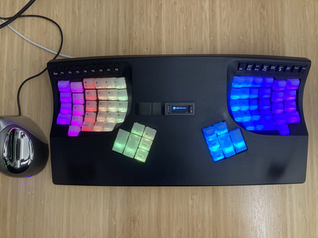

# PCBs to add per-key RGB lighting to Kinesis Advantage

# Attribution

Board outlines and starting schematics:

* [Pillz Mod](https://github.com/dcpedit/pillzmod) for main and thumb pcbs
* [kinesis-fn](https://github.com/bluelightning32/kinesis-fn) for function key pcbs 
